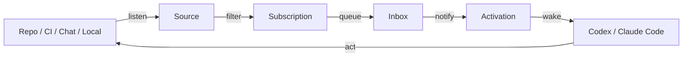
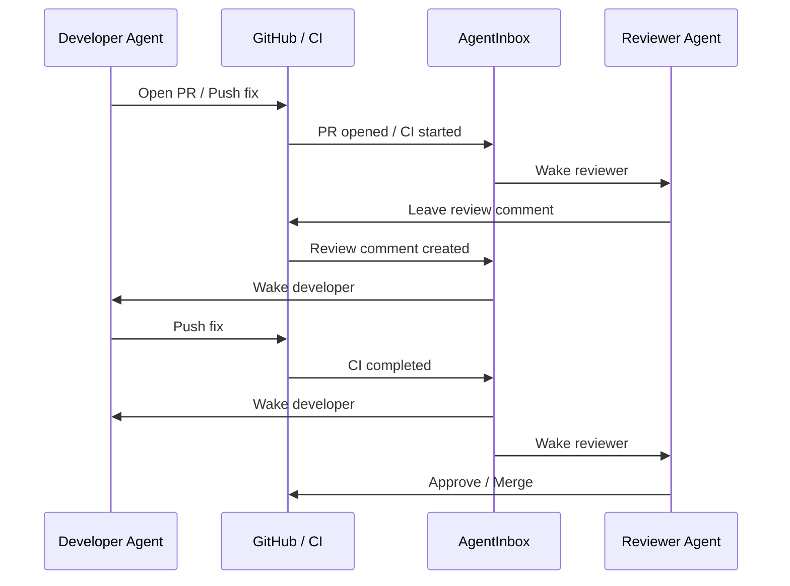

# AgentInbox

`AgentInbox` is the local event inbox and activation service for agents.

It connects external and local event sources, stores them as durable streams,
routes them by subscription, and lets agents read, watch, acknowledge, and
reply through one boundary.

`AgentInbox` is not an agent runtime. It sits between outside systems and local
agent runtimes.

In practice, that means `AgentInbox` can:

- share one GitHub or Feishu source across multiple local agents
- materialize those events into durable inboxes
- wake or drive agent sessions running in `tmux` or `iTerm2`, even when the
  agent runtime does not expose a notification API

## Event Flow

At a high level, `AgentInbox` sits between external events and the current
agent session:



## Review Workflow

One concrete workflow is reviewer / developer collaboration around a PR:



`AgentInbox` is what lets both agents stay in the loop without polling GitHub
manually or relying on the agent runtime to expose its own notification API.

## Status

`AgentInbox` is public beta software.

- the local control plane, daemon model, inbox model, and activation targets
  are implemented
- GitHub repo, GitHub repo CI, Feishu bot, and local event ingress source
  adapters are implemented
- filtering and source model are still evolving
- first-run onboarding is currently skill-first rather than wizard-first

## Install

Requires:

- Node.js 20 or newer
- `uxc` 0.14.0 or newer if you want to use GitHub or Feishu adapters

Install globally:

```bash
npm install -g @holon-run/agentinbox
```

Or run directly:

```bash
npx @holon-run/agentinbox --help
```

If you are developing from source:

```bash
npm install
npm run build
node dist/src/cli.js --help
```

## Recommended Onboarding

If you are using Codex or Claude Code, start with the bundled AgentInbox skill:

- repo copy: [`skills/agentinbox/SKILL.md`](./skills/agentinbox/SKILL.md)
- docs site copy: `https://agentinbox.holon.run/skills/agentinbox/SKILL`

That skill is the recommended onboarding path. It can guide the agent through:

- checking or installing `agentinbox`
- checking or installing `uxc`
- importing GitHub auth from the local `gh` CLI via `uxc auth credential import github --from gh`
- registering the current terminal session as an agent
- adding GitHub sources and standing subscriptions using the docs-site examples

## Quick Start

Start the local daemon:

```bash
agentinbox daemon start
```

Register the current terminal session:

```bash
agentinbox agent register
agentinbox agent register --agent-id agent-alpha
agentinbox agent current
```

Create a local source and publish an event:

```bash
agentinbox source add local_event local-demo
agentinbox subscription add <source_id>
agentinbox subscription add <source_id> --agent-id <agent_id>
agentinbox subscription add <source_id> --filter-file ./filter.json
cat filter.json | agentinbox subscription add <source_id> --filter-stdin
agentinbox source event <source_id> --native-id demo-1 --event local.demo
agentinbox inbox read
agentinbox inbox read --agent-id <agent_id>
```

Update an existing source in place:

```bash
agentinbox source update <source_id> --config-json '{"channel":"infra"}'
agentinbox source update <source_id> --clear-config-ref
```

Pause and resume a managed remote source:

```bash
agentinbox source pause <remote_source_id>
agentinbox source resume <remote_source_id>
```

Remove a task-specific subscription without deleting the whole agent:

```bash
agentinbox subscription remove <subscription_id>
```

## Docs

Public docs live in the mdorigin site under [`docs/site`](./docs/site).

- docs site: `https://agentinbox.holon.run`
- docs home: [`docs/site/README.md`](./docs/site/README.md)
- onboarding with the agent skill: [`docs/site/guides/onboarding-with-agent-skill.md`](./docs/site/guides/onboarding-with-agent-skill.md)
- getting started: [`docs/site/guides/getting-started.md`](./docs/site/guides/getting-started.md)
- review workflows: [`docs/site/guides/review-workflows.md`](./docs/site/guides/review-workflows.md)
- skill docs: [`skills/README.md`](./skills/README.md)
- CLI reference: [`docs/site/reference/cli.md`](./docs/site/reference/cli.md)
- source types: [`docs/site/reference/source-types.md`](./docs/site/reference/source-types.md)
- architecture: [`docs/site/concepts/architecture.md`](./docs/site/concepts/architecture.md)
- event bus design: [`docs/site/concepts/eventbus-backend.md`](./docs/site/concepts/eventbus-backend.md)
- event filtering RFC: [`docs/site/rfcs/event-filtering.md`](./docs/site/rfcs/event-filtering.md)

Preview the docs site locally:

```bash
npm run docs:dev
```

Build the Cloudflare deploy bundle:

```bash
npm run docs:index
npm run docs:build
```

## Development

Run tests:

```bash
npm test
```

Build the CLI:

```bash
npm run build
```

Build docs directory indexes:

```bash
npm run docs:index
```

Generate new SQLite migrations after schema changes:

```bash
npm run db:migrations:generate
```

`AgentInbox` now upgrades SQLite state with versioned SQL migrations in
`drizzle/migrations`. On upgrade with pending migrations, the daemon creates a
local backup next to the DB file (for example,
`~/.agentinbox/agentinbox.sqlite.backup-<timestamp>`).

## License

Apache-2.0
